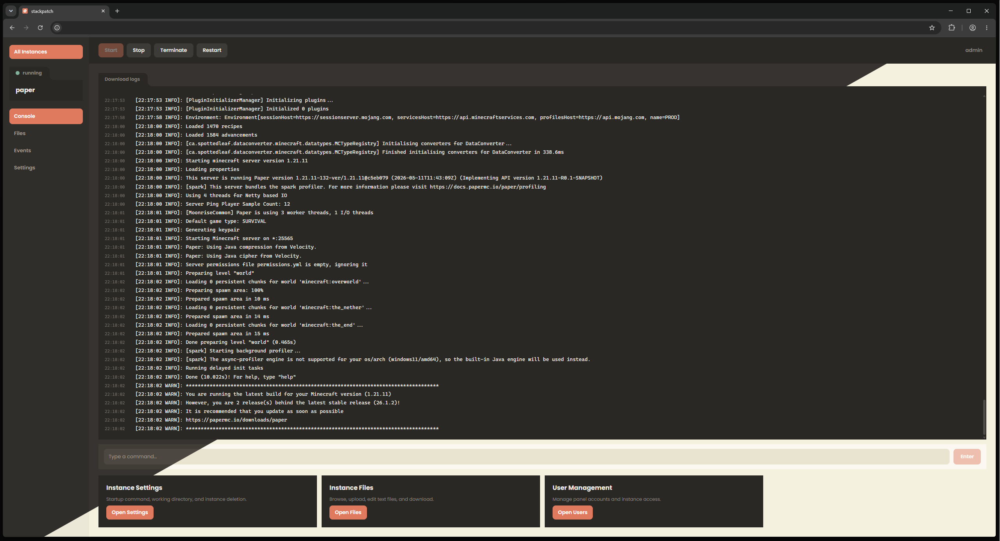

# stackpatch

A lightweight open source web-based server panel for hosting game and application servers on Windows, with Linux support coming.




## why does stackpatch exist?
A lot of game servers and small applications run on spare hardware like old optiplex, or thinkpad laptops and desktops. Setting up Pterodactyl or a similar panel on that kind of hardware means installing Docker, configuring MySQL, overall just quite a lot of un-needed work. stackpatch is built for that gap. It runs directly on Windows without containers or external databases, uses a single SQLite file for persistence, and aims to stay small enough, to not burn any 3rd gen intel core i3 you plan to run it on. Note that as mentioned above, Linux support is planned out.

---

## features

- Start, stop, restart, and terminate server instances
- Live console output with real-time log streaming
- Send commands directly to running processes
- Multiple instances running in parallel
- User management and instance access control
- Scheduled actions per instance
- Works with Minecraft (Paper and others), Python apps, Java applications, and most processes that run from a command line

---

## requirements

- Windows 10 or later (Linux support planned)
- Node.js 22.5 or later
- pnpm 9 (installed automatically on first run of `start.bat` or `pnpm run start:prod`)

---

## getting started

**Production (recommended for hosting):**

```bash
git clone https://github.com/saltgranule/stackpatch
cd stackpatch
pnpm run start:prod
```

On Windows, double-click `start.bat` instead — same as `pnpm run start:prod`.

**Development (UI hot reload, Vite middleware):**

```bash
pnpm install
pnpm run dev
```

Open [http://localhost:23333](http://localhost:23333) in your browser.

Default login: `admin` / `changeme` (change after first sign-in).

---

## project structure

```
packages/
  ui/       React + Vite frontend
  api/      Fastify backend, REST and WebSocket
  daemon/   Node.js process manager, communicates via TCP IPC
  shared/   Types and protocol definitions shared across packages
```

---

## UI
area's of this panel's original design were heavily influenced by the TVA or Time Variance Authority entity from the Loki show on Disney plus.
components are often solid, borderless, with a retro, warm, pastel feel. 
Mobile support is around 80% done, though it is still very much in progress.
full light/darkmode themeing.


---

## what's planned?
memory / cpu limiting per instance, useful in scenario's where multiple instances are running at once.
storage limiting per instance, essentially the same as above, just limiting the amount of disk space an instance can use, likely with some form of UI feedback.

---

## configuration

| Setting | Default | Notes |
|---|---|---|
| Panel port | `23333` | Open at `http://localhost:23333`; configurable via `system_settings` |
| Daemon IPC port | `24444` | Configurable via `system_settings` or env |
| Data directory | `.data/` | SQLite database and daemon heartbeat file + instances |

---

## License

MIT